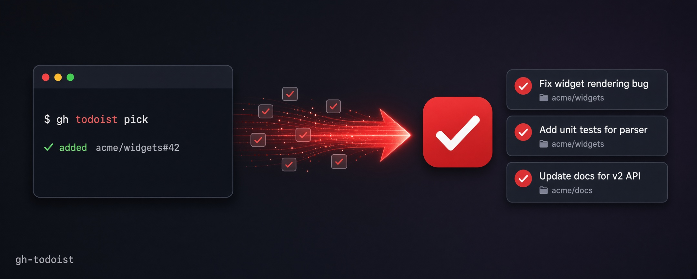

# gh-todoist



A [`gh`](https://cli.github.com) extension that pushes **hand-picked** GitHub
issues into Todoist as tasks. It is a curated push, not a mirror: you choose
what crosses the boundary, so Todoist stays a short worklist rather than a dump
of every issue assigned to you. The sync is strictly one-way — **this tool never
writes to GitHub**, not under any command or flag; it only ever reads issues,
and everything it writes goes to your Todoist and a local state file.

## Install

```sh
gh extension install albttx/gh-todoist
```

Then set your Todoist API token (Todoist → Settings → Integrations → Developer):

```sh
export TODOIST_API_TOKEN="..."
gh todoist init
```

GitHub auth needs no setup — the extension reuses the credentials `gh` already
holds. From source: `go build -o gh-todoist ./cmd/gh-todoist && gh extension install .`

## Quick start

```sh
gh todoist init            # write ~/.config/gh-todoist/config.toml
gh todoist status          # check the token and project resolution
cd ~/src/some-repo
gh todoist pick            # choose from the repo's open issues
gh todoist add 812         # or push one issue directly
gh todoist sync            # complete tasks whose issues have closed
```

## Commands

| Command | What it does |
|---|---|
| `add [ref...]` | Push specific issues, in one batched call. A ref is `812`, `owner/repo#812`, or a full issue URL. |
| `pick` | Interactive multi-select over a repo's open issues (assigned to you when outside a repo). `/` filters, `↓` drops into the list, `enter` selects while filtered and pushes when not, `esc` backs out then quits. `--assign[=user]` filters by assignee. Already-tracked ones are hidden. |
| `sync` | Complete Todoist tasks whose issues closed on GitHub, and tombstone tasks you completed in Todoist. |
| `status` | Read-only drift report plus config diagnosis: token found, which config layer wins, what it resolves to. |
| `init` | Create `config.toml` if absent, seeded with your live Todoist project names as comments. |

Run `gh todoist <command> --help` for flags.

## Configuration

`~/.config/gh-todoist/config.toml`, created by `init`. The file is the
documentation:

```toml
[todoist]
# api_token = "..."            # optional; TODOIST_API_TOKEN env wins
label = "gh"                    # applied to every task; also how sync finds them
                                # again, so changing it orphans existing tasks
default_project = "Work"        # optional fallback, by name

# Mapping is keyed by local checkout path, not by owner/repo. An entry matches
# when the working directory is inside `path`; longest path wins. ~ expands.
[projects.myrepo]
path = "~/src/github.com/owner/repo"
todoist_project = "Side Projects"       # by name, resolved via the API
# todoist_project_id = "abc123def456"   # by id; wins over the name if both are set
```

**Token:** `TODOIST_API_TOKEN` env, then `[todoist].api_token`.

**Project:** `--project` flag, then the `[projects.*]` entry matching your
working directory, then `TODOIST_PROJECT` env, then `[todoist].default_project`,
then your Todoist Inbox. `gh todoist status` prints which layer won.

Priority is mapped from GitHub labels (`p0`/`critical`/`security` → urgent,
`bug`/`p1` → high), and a milestone due date becomes the task's due date.

## How tracking works

Each task carries the `gh` label and a markdown link to its issue, and
`~/.local/state/gh-todoist/state.json` maps issue URL to task id — three
redundant layers, so the state file can be rebuilt from the other two if lost.
Creates are idempotent: the command uuid derives from the issue URL, so Todoist
itself refuses a duplicate. A task you complete in Todoist is *tombstoned* and
never re-added unless you pass `--revive`. The finer contracts (batch
semantics, priority mapping, revive keys) are documented on the packages:
`go doc ./pkg/todoist`.

## Use as a library

The two API clients are public and import nothing from `internal/`, so they
stand alone: **`pkg/todoist`** (an API v1 client that creates tasks through
`/sync`, for the idempotency key the REST endpoint lacks) and **`pkg/ghsrc`**
(a read-only GitHub issue source over `cli/go-gh`). Run
`go doc github.com/albttx/gh-todoist/pkg/todoist` for the contract.

## Development

```sh
go build ./... && go vet ./... && go test -race ./...
gofmt -l . && golangci-lint run
```

CI runs the same on every push to main and pull request; `release` fires on
`v*` tags.

## License

MIT
